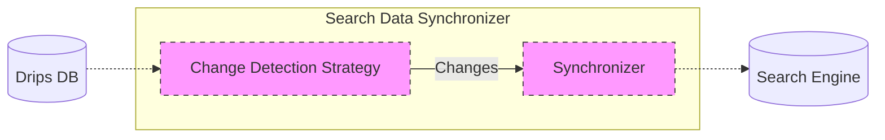
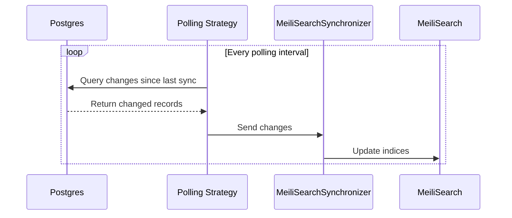

# Search Data Synchronizer

A service that synchronizes data between the Drips database and search indices to power search functionality in the Drips application.

## Core Functionality

The service watches for changes to two types of data:

1. Drip Lists
2. Projects (GitHub repositories)

When changes are detected, it automatically updates the corresponding search indices.

## Architecture

The service follows a modular architecture centered around two main abstractions:

1. **`ChangeDetectionStrategy`**: Defines how changes are detected in the source database

2. **`Synchronizer`**: Defines how changes are propagated to the search engine

## Implementation

The current implementation uses the following concrete implementations of the abstractions:

1. **`ChangeDetectionStrategy`** → **Polling Strategy**: Implements periodic polling of Postgres database

2. **`Synchronizer`** → **`MeiliSearch`**: Manages MeiliSearch indices and updates

## Development

1. Copy `.env.example` to `.env`
2. Configure the environment variables according to your setup
3. Run `docker compose up -d` to spin up MeiliSearch
4. Run `npm run dev` to run the app

## Deployment

Deploy either as:

- Standalone Node.js service
- Docker container (using provided `docker-compose.yml`)
